# 复现说明

以下代码均在windows系统下运行，运行环境如下

Paddle：paddle2.4.0，安装paddle3d

Torch：都按照MMdet3d最新版进行安装——[MMdet3d安装文档](https://mmdetection3d.readthedocs.io/zh_CN/latest/getting_started.html#id2)

Paddle代码中，在根目录下，有train_model.py和test_model.py用来训练和测试。相应的在Torch代码中，在根目录下，有train.py和test.py用来训练和测试。以上代码都以配置好config文件和权重，可以直接运行py文件。

数据集准备：数据集采用nuscenes mini版本来进行验证，其中数据集标注文件采用mmdet3d中对nuscenes数据集处理的方法生成nuscenes_infos_train.pkl和nuscenes_infos_val.pkl文件。

最后data文件夹处理成如下形式

└─data

    └─nuscenes
        ├─maps
        ├─nuscenes_gt_database
        ├─samples
        ├─v1.0-mini
        ├─nuscenes_infos_train.pkl
        ├─nuscenes_infos_val.pkl  

将data文件夹放到torch和paddle的根目录下。

**由于设备原因，torch和paddle部分，均将图片resize到(256, 256)来进行验证， 通过在数据增强部分添加ResizeImage来实现**


# 数据增强对齐

## PhotoMetricDistortionMultiViewImage复现

其中所有操作的使用概率均为0.5，通过打开所有操作来固定结果, 并对其中的参数进行人为固定，brightness_delta=16，contrast=0.5，saturation_range=0.5，hue_delta=9，比对输出的img情况。固定后代码如下

```python
@manager.TRANSFORMS.add_component
class fixed_PhotoMetricDistortionMultiViewImage(object):
    """Apply photometric distortion to image sequentially, every transformation
    is applied with a probability of 0.5. The position of random contrast is in
    second or second to last.
    1. random brightness
    2. random contrast (mode 0)
    3. convert color from BGR to HSV
    4. random saturation
    5. random hue
    6. convert color from HSV to BGR
    7. random contrast (mode 1)
    8. randomly swap channels
    Args:
        brightness_delta (int): delta of brightness.
        contrast_range (tuple): range of contrast.
        saturation_range (tuple): range of saturation.
        hue_delta (int): delta of hue.
    """

    def __init__(self,
                 brightness_delta=32,
                 contrast_range=(0.5, 1.5),
                 saturation_range=(0.5, 1.5),
                 hue_delta=18):
        self.brightness_delta = brightness_delta
        self.contrast_lower, self.contrast_upper = contrast_range
        self.saturation_lower, self.saturation_upper = saturation_range
        self.hue_delta = hue_delta

    def __call__(self, sample):
        imgs = sample['img']
        new_imgs = []
        for img in imgs:
            assert img.dtype == np.float32, \
                'PhotoMetricDistortion needs the input image of dtype np.float32,'\
                ' please set "to_float32=True" in "LoadImageFromFile" pipeline'
            # if random.randint(2):
            # delta = random.uniform(-self.brightness_delta,
            #                     self.brightness_delta)
            delta = 16
            img += delta
            # mode == 0 --> do random contrast first
            # mode == 1 --> do random contrast last
            # mode = random.randint(2)
            mode = 1
            if mode == 1:
                # if random.randint(2):
                # alpha = random.uniform(self.contrast_lower,
                #                        self.contrast_upper)
                alpha = 0.5
                img *= alpha
            # convert color from BGR to HSV
            img = cv2.cvtColor(img, cv2.COLOR_BGR2HSV)
            # random saturation
            # if random.randint(2):
            # img[..., 1] *= random.uniform(self.saturation_lower,
            #                             self.saturation_upper)
            img[..., 1] *= 0.5

            # random hue
            # if random.randint(2):
            # img[..., 0] += random.uniform(-self.hue_delta, self.hue_delta)
            img[..., 0] += 9
            img[..., 0][img[..., 0] > 360] -= 360
            img[..., 0][img[..., 0] < 0] += 360

            # convert color from HSV to BGR
            img = cv2.cvtColor(img, cv2.COLOR_HSV2BGR)
            # random contrast
            if mode == 0:
                if random.randint(2):
                    alpha = random.uniform(self.contrast_lower,
                                        self.contrast_upper)
                    img *= alpha
            # randomly swap channels
            # if random.randint(2):
            img = img[..., [2, 0, 1]]
            new_imgs.append(img)
        sample['img'] = new_imgs
        return sample
```

在padle和torch的yaml文件中加入此数据增强操作，在val数据集进行对比为了方便同时固定了图片的读入顺序。

<center>
    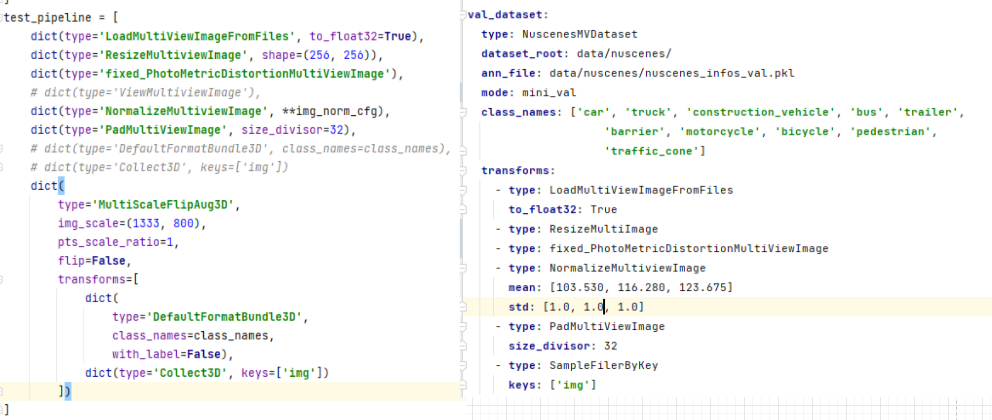
    <br>
    <div style="color:orange; border-bottom: 1px solid #d9d9d9;
    display: inline-block;
    color: #999;
    padding: 2px;">修改后yaml文件，左：torch，右：paddle</div>
</center>

修改完yaml文件后，并在torch代码中plugin/futr3d/models/detectors/futr3d.py和paddle代码中paddle3d/models/detection/futr3d/futr3d.py，在torch和paddle相应位置打下断点，运行test_model.py和test.py，保存两者的img

<center>
    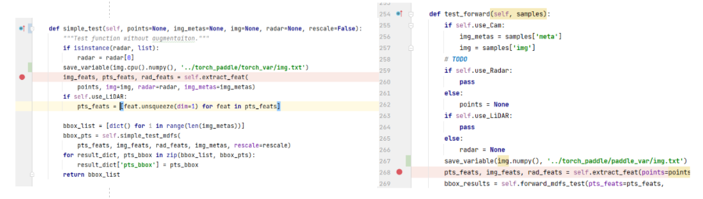
    <br>
    <div style="color:orange; border-bottom: 1px solid #d9d9d9;
    display: inline-block;
    color: #999;
    padding: 2px;">打下断点，左：torch，右：paddle</div>
</center>

<center>
    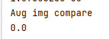
    <br>
    <div style="color:orange; border-bottom: 1px solid #d9d9d9;
    display: inline-block;
    color: #999;
    padding: 2px;">Aug 对比</div>
</center>

## 点云读取复现

### LoadPointsFromFile，LoadPointsFromMultiSweeps， PointsRangeFilter

其中当在test模式下时，第一个sample没有sweep的数据，而在train模式下，第一个sample有sweep的数据，需要固定random choice的值，通过debug，将torch部分的choice固定和paddle相同。

具体代码如下

```python
@manager.TRANSFORMS.add_component
class LoadPointsFromMultiSweeps(object):
    """Load points from multiple sweeps.

    This is usually used for nuScenes dataset to utilize previous sweeps.

    Args:
        sweeps_num (int, optional): Number of sweeps. Defaults to 10.
        load_dim (int, optional): Dimension number of the loaded points.
            Defaults to 5.
        use_dim (list[int], optional): Which dimension to use.
            Defaults to [0, 1, 2, 4].
        time_dim (int, optional): Which dimension to represent the timestamps
            of each points. Defaults to 4.
        pad_empty_sweeps (bool, optional): Whether to repeat keyframe when
            sweeps is empty. Defaults to False.
        remove_close (bool, optional): Whether to remove close points.
            Defaults to False.
        test_mode (bool, optional): If `test_mode=True`, it will not
            randomly sample sweeps but select the nearest N frames.
            Defaults to False.
    """

    def __init__(self,
                 sweeps_num=10,
                 load_dim=5,
                 use_dim=[0, 1, 2, 4],
                 time_dim=4,
                 pad_empty_sweeps=False,
                 remove_close=False,
                 test_mode=False):
        self.load_dim = load_dim
        self.sweeps_num = sweeps_num
        self.use_dim = use_dim
        self.time_dim = time_dim
        assert time_dim < load_dim, \
            f'Expect the timestamp dimension < {load_dim}, got {time_dim}'
        self.file_client = None
        self.pad_empty_sweeps = pad_empty_sweeps
        self.remove_close = remove_close
        self.test_mode = test_mode
        assert max(use_dim) < load_dim, \
            f'Expect all used dimensions < {load_dim}, got {use_dim}'


    def _load_points(self, pts_filename):
        """Private function to load point clouds data.

        Args:
            pts_filename (str): Filename of point clouds data.

        Returns:
            np.ndarray: An array containing point clouds data.
        """
        pts_filename = pts_filename.replace('\\', '/')
        points = np.fromfile(pts_filename, np.float32)
        return points

    def _remove_close(self, points, radius=1.0):
        """Removes point too close within a certain radius from origin.

        Args:
            points (np.ndarray | :obj:`BasePoints`): Sweep points.
            radius (float, optional): Radius below which points are removed.
                Defaults to 1.0.

        Returns:
            np.ndarray: Points after removing.
        """
        if isinstance(points, np.ndarray):
            points_numpy = points
        else:
            raise NotImplementedError

        x_filt = np.abs(points_numpy[:, 0]) < radius
        y_filt = np.abs(points_numpy[:, 1]) < radius
        not_close = np.logical_not(np.logical_and(x_filt, y_filt))
        return points[not_close]

    def __call__(self, results):
        """Call function to load multi-sweep point clouds from files.

        Args:
            results (dict): Result dict containing multi-sweep point cloud
                filenames.

        Returns:
            dict: The result dict containing the multi-sweep points data.
                Added key and value are described below.

                - points (np.ndarray | :obj:`BasePoints`): Multi-sweep point
                    cloud arrays.
        """
        points = results['points']
        points[:, self.time_dim] = 0
        sweep_points_list = [points]
        ts = results['timestamp']
        if self.pad_empty_sweeps and len(results['sweeps']) == 0:
            for i in range(self.sweeps_num):
                if self.remove_close:
                    sweep_points_list.append(self._remove_close(points))
                else:
                    sweep_points_list.append(points)
        else:
            if len(results['sweeps']) <= self.sweeps_num:
                choices = np.arange(len(results['sweeps']))
            elif self.test_mode:
                choices = np.arange(self.sweeps_num)
            else:
                choices = np.random.choice(
                    len(results['sweeps']), self.sweeps_num, replace=False)
                choices = np.array([5, 7, 3, 8, 2, 1, 6, 9, 0])
            for idx in choices:
                sweep = results['sweeps'][idx]
                points_sweep = self._load_points(sweep['data_path'])
                points_sweep = np.copy(points_sweep).reshape(-1, self.load_dim)
                if self.remove_close:
                    points_sweep = self._remove_close(points_sweep)
                sweep_ts = sweep['timestamp'] / 1e6
                points_sweep[:, :3] = points_sweep[:, :3] @ sweep[
                    'sensor2lidar_rotation'].T
                points_sweep[:, :3] += sweep['sensor2lidar_translation']
                points_sweep[:, self.time_dim] = ts - sweep_ts
                sweep_points_list.append(points_sweep)

        points = np.concatenate([p for p in sweep_points_list])
        points = points[:, self.use_dim]
        results['points'] = points
        return results

```

通过比较两者输出的点云和处理后的voxel值，对齐完成

<center>
    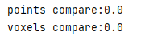
    <br>
    <div style="color:orange; border-bottom: 1px solid #d9d9d9;
    display: inline-block;
    color: #999;
    padding: 2px;">修改后yaml文件，左：torch，右：paddle</div>
</center>


# 前向对齐

前向对齐时去除掉fixed_PhotoMetricDistortionMultiViewImage，后yaml文件为

<center>
    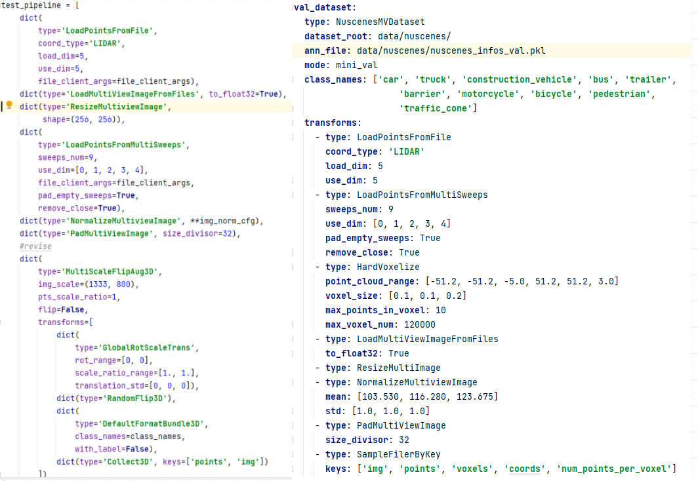
    <br>
    <div style="color:orange; border-bottom: 1px solid #d9d9d9;
    display: inline-block;
    color: #999;
    padding: 2px;">修改后yaml文件，左：torch，右：paddle</div>
</center>

两者在前向时，采用[lidar_cam预训练模型](https://drive.google.com/file/d/1JoUXngi4z436Unt1hNNgwfQ36qa29t1y/view?usp=share_link)的预训练权重

<center>
    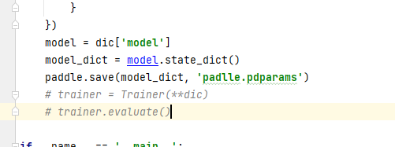
    <br>
    <div style="color:orange; border-bottom: 1px solid #d9d9d9;
    display: inline-block;
    color: #999;
    padding: 2px;">获取paddle.pdparams</div>
</center>

**转为paddle的预训练权重代码如下：**
其中paddle.pdparams权重为保存的paddle模型的权重，可在test_model.py中，修改如下代码获取


```python
import paddle
import torch
from collections import OrderedDict
new_weight_dict = OrderedDict()

paddle_weight = paddle.load('paddle.pdparams')
torch_weight = torch.load('detr3d_resnet101.pth')['state_dict']
# 过滤num_batches_tracked参数
torch_weight_n = {}
for key in torch_weight.keys():
    if 'num_batches_tracked' in key:
        continue
    if 'bld_alpha' in key:
        continue
    if 'pts_bbox_head.code_weights' in key:
        continue
    if 'radar' in key:
        continue
    if 'attr_branches' in key:
        continue
    if 'attn.in_proj_weight' in key:
        bias_key = key.replace('attn.in_proj_weight', 'attn.in_proj_bias')
        print(torch_weight[bias_key].shape)
        q,k,v = torch.split(torch_weight[key], 256, dim=0)
        b_q, b_k, b_v = torch.split(torch_weight[bias_key], 256, dim=0)

        torch_weight_n[key + 'q'] = q
        torch_weight_n[bias_key + 'q'] = b_q
        torch_weight_n[key + 'k'] = k
        torch_weight_n[bias_key + 'k'] = b_k
        torch_weight_n[key + 'v'] = v
        torch_weight_n[bias_key + 'v'] = b_v
        continue
    if 'attn.in_proj_bias' in key:
        # q,k,v = torch.split(torch_weight[key], 256, dim=0)
        # torch_weight_n[key + 'q'] = q
        # torch_weight_n[key + 'k'] = k
        # torch_weight_n[key + 'v'] = v
        continue
    torch_weight_n[key] = torch_weight[key]

reverse_name = [
    'attn.in_proj_weight', 'attn.out_proj.weight', 'attention_weights.weight',
    'img_output_proj.weight', 'radar_attention_weights.weight', 'radar_output_proj.weight',
    'modality_fusion_layer.0.weight', 'modality_fusion_layer.3.weight', 'pos_encoder.0.weight',
    'pos_encoder.3.weight', 'ffns.0.layers.0.0.weight', 'ffns.0.layers.1.weight', 'cls_branches', 'reg_branches','linear',
    'reference_points.weight', 'output_proj.weight', 'position_encoder.0.weight', 'position_encoder.2.weight', 'position_encoder.3.weight'
]

# 根据参数名称和shape 对比paddle和torch参数
for kt, kp in zip(torch_weight_n.keys(), paddle_weight.keys()):
    string1 = '{:>90s}{:>90s}'.format(str(kt), str(kp))
    string2 = '{:>90s}{:>90s}'.format(str(torch_weight_n[kt].numpy().shape), str(paddle_weight[kp].shape))
    if any(name in kt for name in reverse_name):
        if ('cls_branches' in kt or 'reg_branches' in kt) and len(torch_weight_n[kt].shape)!=2:
            pass
        else:
            # linear transpose
            torch_weight_n[kt] = torch_weight_n[kt].T
            torch_shape = torch_weight_n[kt].numpy().shape
            string2 = 'reverse{:>90s}:{:>90s}'.format(str(torch_shape), str(paddle_weight[kp].shape))
    new_weight_dict[kp] = paddle.to_tensor(torch_weight_n[kt].cpu().numpy())
    print(string1)
    print(string2)

print(type(new_weight_dict))
paddle.save(new_weight_dict, 'cam_only_pretrained.pdparams')

```

Paddle加载预训练权重**cam_lidar_pretrained.pdparams**, torch加载预训练权重**lidar_cam_new.pth**

通过运行test.py和test_model.py来进行前向对比，并在torch代码中plugin/futr3d/models/detectors/futr3d.py和paddle代码中paddle3d/models/detection/futr3d/futr3d.py，下图所示位置打下断点，保存参数，在对比backbone，neck，head三个组件的输出情况对比前向。

<center>
    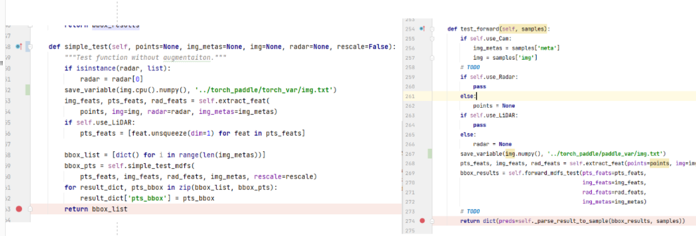
    <br>
    <div style="color:orange; border-bottom: 1px solid #d9d9d9;
    display: inline-block;
    color: #999;
    padding: 2px;">前向 对比断电位置</div>
</center>

<center>
    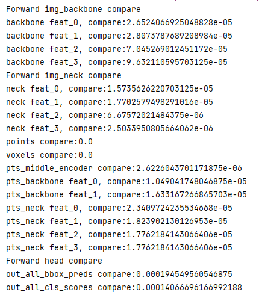
    <br>
    <div style="color:orange; border-bottom: 1px solid #d9d9d9;
    display: inline-block;
    color: #999;
    padding: 2px;">前向 对比</div>
</center>

# 反向对齐

反向对齐时，去除代码中drop out部分和grid_mask部分。

<center>
    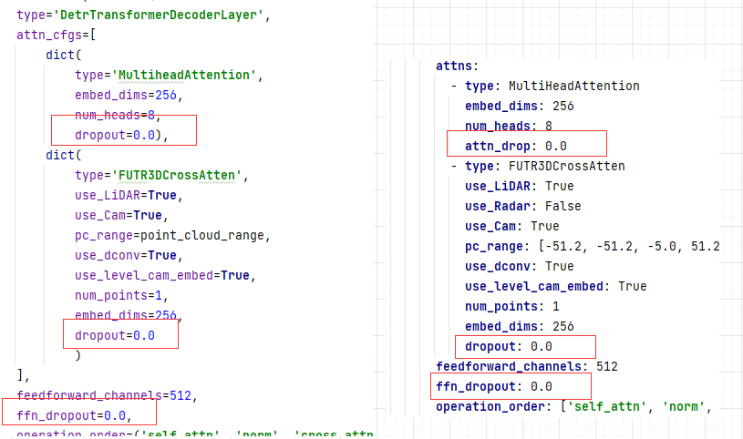
    <br>
    <div style="color:orange; border-bottom: 1px solid #d9d9d9;
    display: inline-block;
    color: #999;
    padding: 2px;">修改后yaml文件，左：torch，右：paddle</div>
</center>

<center>
    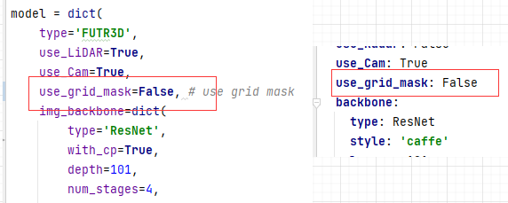
    <br>
    <div style="color:orange; border-bottom: 1px solid #d9d9d9;
    display: inline-block;
    color: #999;
    padding: 2px;">修改后yaml文件，左：torch，右：paddle</div>
</center>

数据读取部分，预先保存两者相同的数据进行反向对齐

<center>
    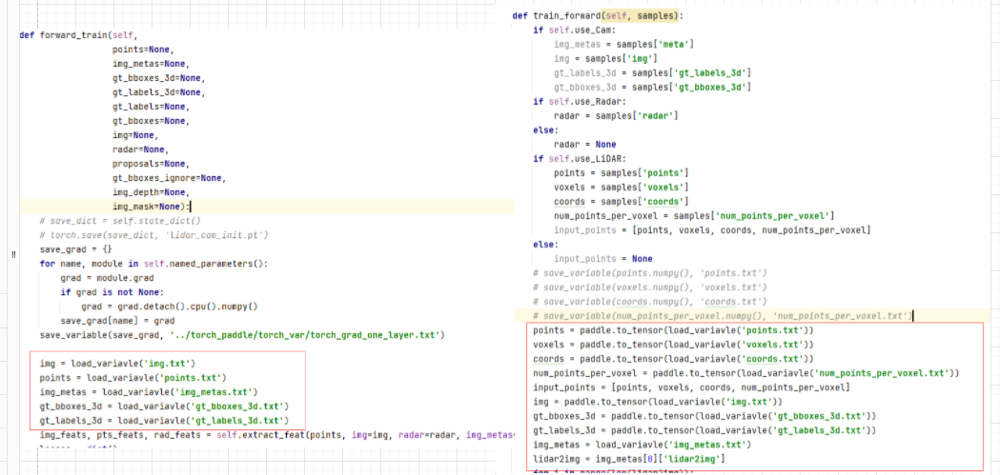
    <br>
    <div style="color:orange; border-bottom: 1px solid #d9d9d9;
    display: inline-block;
    color: #999;
    padding: 2px;">载入相同的数据，左：torch，右：paddle</div>
</center>


Paddle加载预训练权重**cam_lidar_init.pdparams**, **torch加载预训练权重,起预训练权重为detr3d_resnet101和lidar_only两个权重fuse的结果**。

<center>
    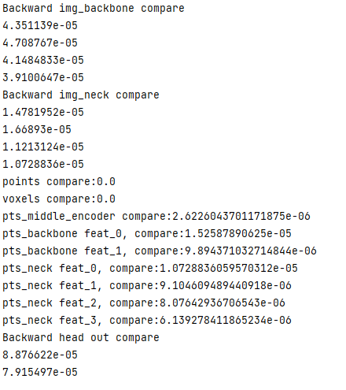
    <br>
    <div style="color:orange; border-bottom: 1px solid #d9d9d9;
    display: inline-block;
    color: #999;
    padding: 2px;">载入相同的数据，左：torch，右：paddle</div>
</center>


